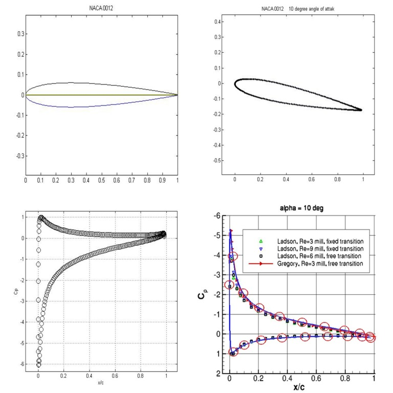

# Aerodynamics simulation applications.

By Mohammad Zandsalimy (mohammad.zandsalimy@ubc.ca)

Some of my previous projects are presented below.

## Vortex Panel Method
This is a program for computing the pressure distribution and lift over NACA 4-digit airfoils in a potential flow field. The airfoil is generated and the geometry is built using potential vortex panels, then the flow field is numerically solved and pressure coefficients on these panels are calculated. The user is free to choose any NACA 4-digit airfoil and angle of attack, but the prediction of flow is valid only at low angles of attack, until the flow detachment occurs. Here we can see a NACA 0012 airfoil at a 10 degree angle of attack analyzed by the code. On the bottom right side plot the predicted pressure coefficients are compared to those in the experiment, the large red  circles are my predictions and there is a very low error.

## Conical Flow Solver
This method is based on the Taylor Maccoll method for calculating the shock angle given both flow mach number and cone deflection angle. Conical flow calculations are important for many applications such as supersonic engine intake design. The program can input the cone angle and free stream Mach number and output the shock angle, or simply calculate a table for general use as seen here. 

## Nozzle Fanno Pipe Analyser 
This code can calculate the pressure and mach number inside the system of a nozzle and a Fanno pipe. This problem is important in designing supersonic wind tunnels. In this problem there reservoir is at 500 [kpa] to the left side of the nozzle. The back pressure is reduced from a high pressure to low pressure.

